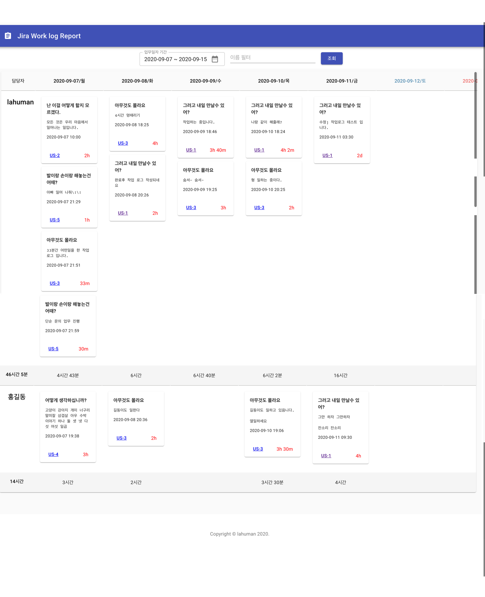
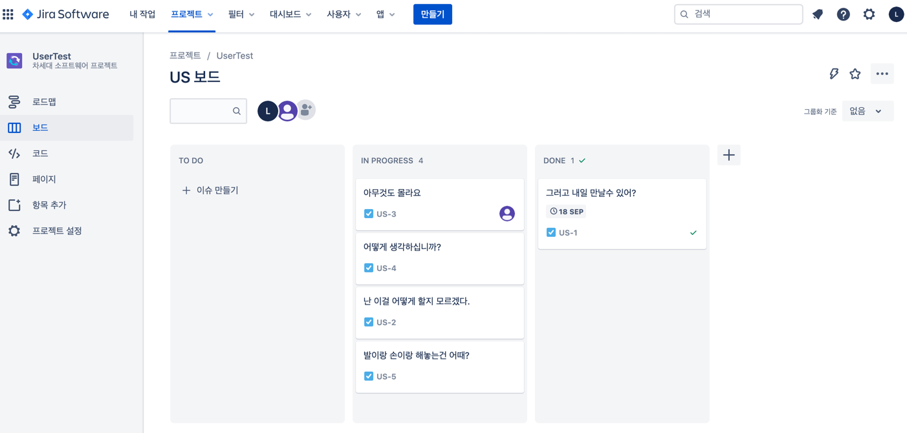

# Jira Work log Report

> 지라에서 작성한 work log를 아래 그림과 같이 날짜 기준으로 표기해 줍니다.

***Screen***




## Table of Contents 

> 사용된 프로그램과 설정시 중요 내용

- [Installation](#installation)
- [JiraCloud](#jiracloud)
- [Dockerfile](#dockerfile)
- [Version](#version)
- [License](#license)


---

## Installation

- 설치를 위해서는 기본적으로 NODEJS 12.x 이상의 버젼이 필요합니다.


### Backend

- [Oas 3.0](https://swagger.io/specification/) 기반으로 작성되었습니다.
- PATH : **report_backend**

> .env 설정은 _env 파일을 .env로 변경하여서 Key에 알맞은 값을 설정 하면 됩니다.
또는 아래 샘플을 이용하셔요.
TOKEN_KEY는 API 토큰입니다. JIRA CLOUD에 가입이 되어 있다면, API 토큰은 [여기에서](https://id.atlassian.com/manage-profile/security/api-tokens)에서 생성이 가능합니다.

```
JIRA_HOST=https://lahuman.atlassian.net # jira host 정보
JIRA_ID=lahuman@emaim.com # JIRA ID
TOKEN_KEY=abcde # JIRA API TOKEN
```

> 실행

```
$ npm run start
```

서버가 문제 없이 기동이 되면 [Swagger UI](http://localhost:8080/docs)을 확인하세요.

### Frontend

- [ReactJS](https://reactjs.org/)로 작성되어 있습니다.
- PATH : **report_frontend**

> .env 설정은 _env 파일을 .env로 변경하여서 Key에 알맞은 값을 설정 하면 됩니다.
또는 아래 샘플을 이용하셔요.

```
REACT_APP_API_URL=http://localhost:8080  # backend server 주소
REACT_APP_API_JIRA_BROWSE=https://lahuman.atlassian.net/browse/ #jira의 browse 주소
```

> 실행 

```
$ npm install
# npm run start
```

## JiraCloud

> [JIRA Cloud](https://www.atlassian.com/ko/software/free#plan-and-track)는 무료로 사용이 가능한 플랜이 있습니다
가입을 하면 다음과 같이 사용이 가능합니다.



- https://lahuman.atlassian.net


---

## Dockerfile

- docker image 생성 파일 제공
- Dockerfile 참조

> 이미지 생성

```
# docker build -t ${image-name}:${version} .

$ docker build -t jira-report:1.0 .
```

> 이미지 실행 

```
# docker run -p 8888:80 --rm ${image-name}:${version}

$ docker run -p 8888:80 --rm jira-report:1.0
```

[Dockerfile 더 자세히 알아보기](https://lahuman.github.io/reactjs-dockerfile/)

---

## Version

- v1.1 : 화면 레이아웃에 대한 조절 진행
    + 테이블 화면에 가득 차도록 변경
    + 이름 밑에 총 시간 표기
    + 폰트 사이즈 수정
    + 버튼 위치 조정
    + 범위에 대한 아래 라인 추가

- v1.0 : JIRA Cloud 와 연동하여 Work log 내역을 표기 하는 기능 개발

---

## License

[](http://badges.mit-license.org)

- **[MIT license](http://opensource.org/licenses/mit-license.php)**
- Copyright 2020 © <a href="https://lahuman.github.io" target="_blank">lahuman</a>.
